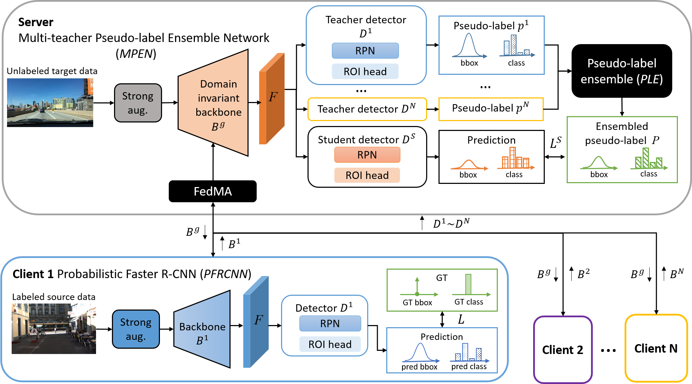
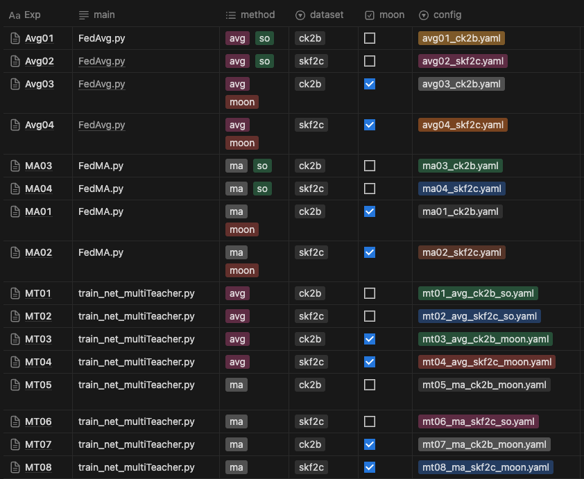

# (FedCoin) Federated Contrastive Domain Adaptation for Category-inconsistent Object Detection



This repo is the official implementation of VCIP paper "[Federated Contrastive Domain Adaptation for Category-inconsistent Object Detection](https://ieeexplore.ieee.org/document/xxxx/)" by WeiYu Chen, Peggy Lu, Vincent S. Tseng.

# Installation

You can choose one of the following methods to install Python-related packages in the files "requirements.txt" and "conda_environment.yaml."

* requirements.txt

This requirements is including the project Detectron2 [INSTALL.md](https://github.com/facebookresearch/detectron2/blob/master/INSTALL.md). We use version: ```detectron2==0.6```

```shell
conda install --file requirements.txt
```

* conda_environment.yaml

```shell
conda env create -f conda_environment.yaml
```

# Environment Preparation

### Dataset
Plz refer to [prepare_data.md](docs/prepare_data.md) for datasets preparation.

- [dataset.tar (69GB)](https://cos.twcc.ai/t2datashare/ptmoon/dataset.tar)

```
./data/
├── VOC2007_bddtrain
├── VOC2007_bddval 
├── VOC2007_citytrain 
├── VOC2007_cityval 
├── VOC2007_foggytrain
├── VOC2007_foggyval 
├── kitti 
├── multi-ck 
├── multi-skf
└── sim
```

### Backbone Model 

We used VGG16 pre-trained on ImageNet for all experiments. You can download it to ```/path/to/project```:

- [VGG16.pth (0.5GB)](https://cos.twcc.ai/t2datashare/vgg16_caffe.pth)

### Pretrained Model

You can download and decompress the zip file to "output/" directory.
- [pretrain_models.zip (9.5GB)](https://cos.twcc.ai/t2datashare/pretrain_model.zip)

```
pretrain_model/
├── avg01_ck2b_so_20240411
├── avg02_skf2c_so_20240408
├── avg03_ck2b_moon_20240411
├── avg03_dyn_ck2b_20240607
├── avg03_inv_ck2b_20240517
├── avg04_dyn_skf2c_20240611
├── avg04_inv_skf2c_20240611
├── avg04_skf2c_moon_20240411
├── ma01_ck2b_cla8_20240501
├── ma02_skf2c_cla8_20240411
├── ma03_ck2b_cla8_20240422
└── ma04_skf2c_cla8_20240411
```
you can also put pretrain_model/* to output/ to fix the config/*.yaml locations.

# Usage


### Experiments Setup


### config example
```python
## 以下範例為 CK->B 
_BASE_: "../Guassian-RCNN-VGG.yaml"
MODEL:
  ROI_HEADS:
    NUM_CLASSES: 1
  GLOBAL_TRAINER: "sourceonly"
  LOCAL_TRAINER: "sourceonly"
SOLVER:
  LR_SCHEDULER_NAME: "WarmupMultiStepLR"
  STEPS: (4000,) # 每一round 跑多少 iteration 
  MAX_ITER: 4000  # 與STEPS對齊
  IMG_PER_BATCH_LABEL: 16
  IMG_PER_BATCH_UNLABEL: 16
  BASE_LR: 0.016
  WARMUP_ITERS: 0
  CHECKPOINT_PERIOD: 800   # 產生 checkpoint 的iteration 數
  REFERENCE_BATCH_SIZE: 16
# 這邊為新增控制項
MOON:
  CONTRASTIVE_Lcon_Enable: False  # 是否 contrastive learning
  CONTRASTIVE_MU: 0.5  # contrastive learning 的參數 MU
  CONTRASTIVE_T: 0.5  # contrastive learning 的參數 T
  WANDB_Enable: True  # 是否使用wandb 紀錄
  WANDB_Project_Name: "FedAvg_ck2b_multiclass_20240411"
DATALOADER:
  NUM_WORKERS: 2
FEDSET:
  DYNAMIC_CLASS: (8,5) # 對齊 DATASET_LIST 的類別數
  THREAD: False
  ROUND: 3  # 要跑幾輪
  DATASET_LIST: ("VOC2007_citytrain","VOC2007_kitti5") # 資料集
  BACKBONE_ONLY: True
DATASETS:
  CROSS_DATASET: True
  TEST: ("VOC2007_bddval8",)  # 測試資料集
UNSUPNET:
  Trainer: "sourceonly"
  TEACHER_UPDATE_ITER: 1
  BURN_UP_STEP: 0
  EMA_KEEP_RATE: 0.9996
  SOURCE_LOSS_WEIGHT: 1.0
  TARGET_UNSUP_LOSS_WEIGHT: 1.0
  GUASSIAN: True
  EFL: True
  EFL_LAMBDA: [0.5,0.5]
  TAU: [0.25,0.25]
TEST:
  EVAL_PERIOD: 400    # 跑多少 iteration 會 evaluate 一次
  EVALUATOR: "VOCeval"
INPUT:
  MIN_SIZE_TRAIN: (600, )
  MIN_SIZE_TEST: 600
  RANDOM_FLIP: "horizontal"
OUTPUT_DIR: "./output/FedAvg_ck2b_multiclass_20240411/"  # 輸出資料夾
```

### main file
* train_net_FedAvg.py
* train_net_FedMA.py
* train_net_multiTeacher.py

## Train on Client
### FedAvg

```shell
python train_net_FedAvg.py --config configs/multiclass/avg01_ck2b.yaml
python train_net_FedAvg.py --config configs/multiclass/avg02_skf2c.yaml
python train_net_FedAvg.py --config configs/multiclass/avg03_ck2b.yaml
python train_net_FedAvg.py --config configs/multiclass/avg04_skf2c.yaml
```

### FedMA  

```shell
python train_net_FedMA.py --config configs/multiclass/ma01_ck2b.yaml
python train_net_FedMA.py --config configs/multiclass/ma02_skf2c.yaml
python train_net_FedMA.py --config configs/multiclass/ma03_ck2b.yaml
python train_net_FedMA.py --config configs/multiclass/ma04_skf2c.yaml
```


## Train on Server

### Multi Target （ 8 class ）
```shell
python train_net_multiTeacher.py --config configs/multiclass/mt01_avg_ck2b_so.yaml
python train_net_multiTeacher.py --config configs/multiclass/mt02_avg_skf2c_so.yaml
python train_net_multiTeacher.py --config configs/multiclass/mt03_avg_ck2b_moon.yaml
python train_net_multiTeacher.py --config configs/multiclass/mt04_avg_skf2c_moon.yaml
python train_net_multiTeacher.py --config configs/multiclass/mt05_ma_ck2b_so.yaml
python train_net_multiTeacher.py --config configs/multiclass/mt06_ma_skf2c_so.yaml
python train_net_multiTeacher.py --config configs/multiclass/mt07_ma_ck2b_moon.yaml
python train_net_multiTeacher.py --config configs/multiclass/mt08_ma_skf2c_moon.yaml
```


### MultiTeacher [ Ablation Study ] 
```shell
python train_net_multiTeacher.py  --config configs/ablation/avg03_dyn_ck2b.yaml
python train_net_multiTeacher.py  --config configs/ablation/avg03_inv_ck2b.yaml
python train_net_multiTeacher.py  --config configs/ablation/avg04_dyn_skf2c.yaml
python train_net_multiTeacher.py  --config configs/ablation/avg04_inv_skf2c.yaml
python train_net_multiTeacher.py  --config configs/ablation/mt03_dyn_ck2b.yaml
python train_net_multiTeacher.py  --config configs/ablation/mt03_inv_ck2b.yaml
python train_net_multiTeacher.py  --config configs/ablation/mt04_dyn_skf2c.yaml
python train_net_multiTeacher.py  --config configs/ablation/mt04_inv_skf2c.yaml
```

# Case Study 

### case 1 :  run fedAvg for  skf→c ,  and evaluation only for this model
```shell
# train __your_FedAvg_skf2c_model, you need to modify avg02_skf2c.yaml
python train_net_FedAvg.py --config configs/multiclass/avg02_skf2c.yaml
# evaluate  __your_FedAvg_skf2c_model.pth
python train_net.py --config configs/evaluation/cityeval.yaml --eval-only MODEL.WEIGHTS output/__your_FedAvg_skf2c_model.pth 
```

### case 2 : run  fedMA to FedCoin with contrastive method for skf → c dataset
```shell
# train on client by fedMA
python train_net_FedMA.py --config configs/202405_multiclass/ma04_skf2c.yaml

# domain adapt on server with contrastive method
python train_net_multiTeacher.py --config configs/multiclass/mt08_ma_skf2c_moon.yaml
```

### case 3 : run fedAvg to FedCoin with ablation study for ck → b dataset
```shell
## inverse contrastive method
# train on client by fedAvg with inverse contrastive method
CUDA_VISIBLE_DEVICES=0,1 python train_net_FedAvg.py --num-gpus 2 --config configs/ablation/avg03_inv_ck2b.yaml
# domain adapt on server with inverse contrastive method
CUDA_VISIBLE_DEVICES=0,1 python train_net_multiTeacher.py  --num-gpus 2 --config configs/ablation/mt03_inv_ck2b.yaml

## dynamic contrastive method
# train on client by fedAvg with dynamic contrastive method
CUDA_VISIBLE_DEVICES=0,1 python train_net_FedAvg.py --num-gpus 2 --config configs/ablation/avg03_dyn_ck2b.yaml
# domain adapt on server with dynamic contrastive method
CUDA_VISIBLE_DEVICES=0,1 python train_net_multiTeacher.py  --num-gpus 2 --config configs/ablation/mt03_dyn_ck2b.yaml
```


# Related

## Citation

If you use this project in your research or wish to refer to the results published in the paper, please consider citing our paper:
```BibTeX
```

## License

This project is released under the [Apache 2.0 license](./LICENSE). Other codes from open source repository follows the original distributive licenses.

## Acknowledgement

This project is built upon [Detectron2](https://github.com/facebookresearch/detectron2),  [Unbiased Teacher](https://github.com/facebookresearch/unbiased-teacher) and [MOON](https://github.com/QinbinLi/MOON), and we'd like to appreciate for their excellent works.
