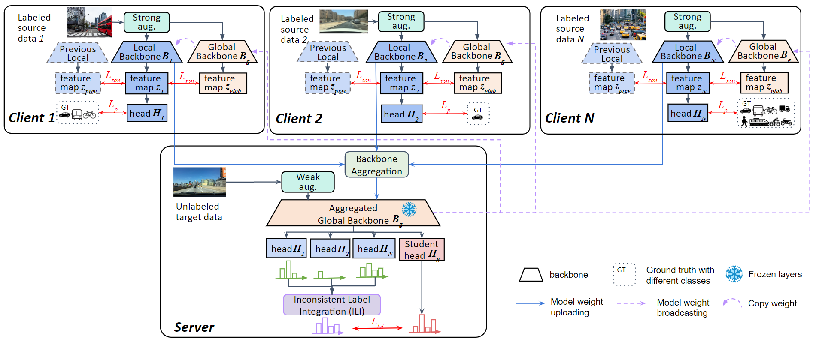

# A Privacy-preserving Approach for Multi-source Domain Adaptive Object Detection



This repo is the official implementation of VCIP paper "[Fedcoin...](https://ieeexplore.ieee.org/document/xxxx/)" by WeiYu Chen, Peggy Lu, Vincent S. Tseng.

## Installation

This requirements is including the project Detectron2 [INSTALL.md](https://github.com/facebookresearch/detectron2/blob/master/INSTALL.md). We use version: ```detectron2==0.6```

```shell
conda install --file requirements.txt
```

### Data Preparation
Plz refer to [prepare_data.md](docs/prepare_data.md) for datasets preparation.

### Pretrained Model

We used VGG16 pre-trained on ImageNet for all experiments. You can download it to ```/path/to/project```:

- VGG16: [Dropbox](https://www.dropbox.com/s/s3brpk0bdq60nyb/vgg16_caffe.pth?dl=0), [VT Server](https://filebox.ece.vt.edu/~jw2yang/faster-rcnn/pretrained-base-models/vgg16_caffe.pth)

### Training

### main file
* train_net_FedAvg.py
* train_net_FedMA.py
* train_net_multiTeacher.py

### config
You can change ```--config configs/pt/final_c2f.yaml``` to other configs in ```configs/xxx``` to reproduce the main results of other tasks.

* configs/FedAvg/xxx.yaml
* configs/FedMA/xxx
* configs/multi-teacher
* configs/source-only


##  training
```
python train_net_multiTeacher.py --config-file configs/multi-teacher/skf2c_foggy_sourceonly_FedMAbackbone.yaml
```


## Citation

If you use this project in your research or wish to refer to the results published in the paper, please consider citing our paper:
```BibTeX
```

## License

This project is released under the [Apache 2.0 license](./LICENSE). Other codes from open source repository follows the original distributive licenses.

## Acknowledgement

This project is built upon [Detectron2](https://github.com/facebookresearch/detectron2) and [Unbiased Teacher](https://github.com/facebookresearch/unbiased-teacher), and we'd like to appreciate for their excellent works.
